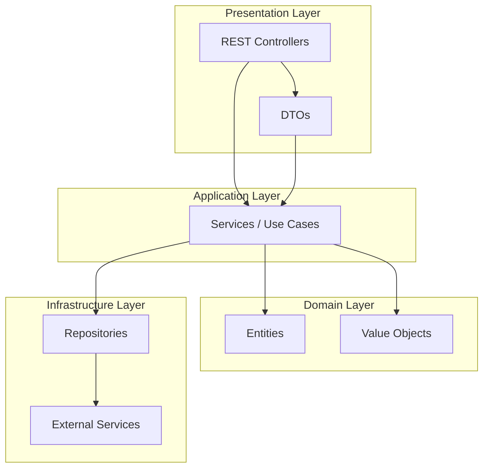

# SkillLink - Alumni Skill Matching Platform

[](https://openjdk.org/projects/jdk/21/)
[](https://spring.io/projects/spring-boot)
[](https://www.mysql.com/)
[](https://github.com/carlosferreyra/skilllink-g6b/actions)
[](LICENSE)
[](https://sonarcloud.io/summary/new_code?id=skilllink)
[](https://sonarcloud.io/summary/new_code?id=skilllink)

> 🚀 A modern backend platform to connect alumni and enable intelligent skill matching within professional networks.

---

## 📋 Table of Contents

-[Description](#description)
- [Features](#features)
- [Architecture](#architecture)
- [Technologies](#technologies)
- [Quick Start](#quick-start)
- [Configuration](#configuration)
- [Project Structure](#project-structure)
- [API](#api)
- [Testing](#testing)
- [Deployment](#deployment)
- [Contributing](#contributing)
- [Team](#team)
- [Roadmap](#roadmap)
- [License](#license)
- [Contact](#contact)

---

<h2 id="description">📖 Description</h2> 

**SkillLink** is a robust backend platform developed in Java 21 with Spring Boot 3.5, designed to connect alumni and enable intelligent skill matching within professional networks. It allows users to register their profiles, showcase their skills, and find mentors or collaborators with complementary skills.

**Purpose:**  
Developed for **Alumnithon 2025**, SkillLink solves the challenge of connecting professionals, facilitating targeted networking, mentoring, and career growth.

---

<h2 id="features">📖 Features</h2> 

- **JWT Authentication** (stateless, refresh tokens)
- **Role-based Authorization** (RBAC)
- **Intelligent user matching** by skills
- **Professional profile management** and experience
- **Email notification system**
- **API documented with Swagger/OpenAPI**
- **Database migrations** with Flyway
- **Monitoring and health checks** with Spring Boot Actuator
- **Structured logging and business metrics**

---

<h2 id="architecture">🏗️  Architecture</h2>

SkillLink implements **Hexagonal Architecture** (Ports & Adapters) and **Domain-Driven Design (DDD)**.

### Architecture Diagram



**Patterns:**  
Repository, Service Layer, DTO, Builder, Factory.

---
<h2 id="technologies">🛠️ Technologies</h2>

- **Java 21** (LTS)
- **Spring Boot 3.5.0** (Spring Security, Spring Data JPA, Validation)
- **MySQL 8.0** (UTF-8)
- **Flyway** (Migrations)
- **Maven 3.8+**
- **Docker & Docker Compose**
- **SpringDoc OpenAPI 3** (Swagger UI)
- **JUnit 5, Mockito, Testcontainers** (Testing)
- **Lombok** (Boilerplate reduction)
- **GitHub Actions** (CI/CD)

---

## 🚀 Quick Start

### Prerequisites

| Tool        | Minimum Version | Recommended |
|-------------|----------------|-------------|
| Java JDK    | 21             | 21 LTS      |
| Maven       | 3.8            | 3.9+        |
| Docker      | 20.10          | 24.0+       |
| Git         | 2.30           | 2.40+       |

### Option 1: Docker (Recommended)

```bash
git clone https://github.com/carlosferreyra/skilllink-g6b.git
cd skilllink-g6b
cp .env.example .env
# Edit .env with your values
docker compose up -d
curl http://localhost:8080/actuator/health
```

### Option 2: Local Development

```bash
git clone https://github.com/carlosferreyra/skilllink-g6b.git
cd skilllink-g6b
mysql -u root -p -e "CREATE DATABASE skilllink_db CHARACTER SET utf8mb4 COLLATE utf8mb4_unicode_ci;"
cp .env.example .env
# Edit .env with your values
mvn clean install
mvn spring-boot:run
curl http://localhost:8080/actuator/health
```

---
<h2 id="configuration>⚙️ Configuration</h2>

### Environment Variables

```bash
# Database
MYSQL_DATABASE=skilllink_db
MYSQL_PORT=3306
MYSQL_HOST=localhost
MYSQL_ROOT_PASSWORD=your_secure_password

# JWT
JWT_SECRET=your_jwt_secret_min_32_characters
JWT_EXPIRATION=86400000

# Email (optional)
EMAIL_HOST=smtp.gmail.com
EMAIL_PORT=587
EMAIL_USER=your-email@gmail.com
EMAIL_PASS=your_app_password

# CORS
FRONTEND_CORS_URL=http://localhost:5173
```

---

<h2 id="project-structure>📂 Project Structure</h2>

``` bash
src/main/java/alumnithon/skilllink/
├── SkilllinkApplication.java           # Main entry point
├── controller/                         # Global controllers (Auth)
├── domain/                            # Business domains
│   ├── auth/                          # Authentication
│   └── userprofile/                   # User profiles
│       ├── controller/                # REST endpoints
│       ├── dto/                       # DTOs
│       ├── interface/                 # Contracts
│       ├── model/                     # Entities
│       ├── repository/                # Repositories
│       └── service/                   # Business logic
├── infrastructure/                    # Infrastructure
│   ├── config/                        # Configuration (Security, Swagger, Web)
│   └── email/                         # Email service
└── shared/exception/                  # Global exception handling
```

---

<h2 id="api">📡 API</h2>

### Interactive Documentation

- **Swagger UI**: ```http://localhost:8080/api/docs/swagger-ui/index.html```.

- **OpenAPI Spec**: ```http://localhost:8080/api/docs```

- **Health Check**: ```http://localhost:8080/actuator/health```

### Main Endpoints

#### Authentication

```http
POST /auth/register         # User registration
POST /auth/login           # Login
POST /auth/refresh         # Refresh token
POST /auth/logout          # Logout
```

#### Profile Management

```http
GET    /api/userprofiles              # List profiles
GET    /api/userprofiles/{id}         # Get profile
PUT    /api/userprofiles/{id}         # Update profile
DELETE /api/userprofiles/{id}         # Delete profile
POST   /api/userprofiles/search       # Advanced search
```

#### Matching and Connections

```http
GET    /api/matches/suggestions/{userId}    # Matching suggestions
POST   /api/matches/connect                # Initiate connection
GET    /api/matches/connections/{userId}   # User connections
```

#### Metrics and Monitoring

```http
GET /actuator/health          # Health status
GET /actuator/metrics         # Application metrics
GET /actuator/info           # System information
```

### Example: User Registration

```bash
curl -X POST http://localhost:8080/api/register \
  -H "Content-Type: application/json" \
  -d '{
    "name": "Ana",
    "email": "ana.garcia@email.com",
    "password": "SecurePass123!"
  }'
```

---

<h2 id="testing"> 🧪 Testing</h2>

- **Unit Tests** (JUnit 5, Mockito)
- **Integration Tests** (Testcontainers, Spring Boot Test)
- **Coverage**: JaCoCo

```bash
mvn test
mvn test -Dtest=UserProfileServiceTest
mvn jacoco:report
open target/site/jacoco/index.html
```

---

<h2 id="deployment">🚀 Deployment</h2>

### Production

```bash
mvn clean package -Pprod
docker build -t skilllink:latest .
docker compose up -d
```

**Required variables:**

- `MYSQL_ROOT_PASSWORD`
- `JWT_SECRET`
- `EMAIL_USER`
- `EMAIL_PASS`

---

<h2 id="contribiting">🤝 Contributing</h2>

1. **Fork** the repository
2. **Create** a branch: `git checkout -b feature/new-feature`
3. **Commit** your changes: `git commit -m 'feat: add new feature'`
4. **Push** to your branch: `git push origin feature/new-feature`
5. **Open** a Pull Request

**Commit standards:**  
Use [Conventional Commits](https://www.conventionalcommits.org/).

**PR Checklist:**

- [ ] Code follows project conventions
- [ ] Includes tests
- [ ] Documentation updated
- [ ] All tests pass

---

<h2 id="team">👥 Team</h2>

### 🚀 Stormtroopers Team

- **Jissy Kakin Merlano Zabaleta** - [@jissykakin](https://github.com/jissykakin) (Project Lead & FullStack)
- **Carlos Eduardo Ferreyra** - [@carlosferreyra](https://github.com/carlosferreyra) (Backend & DevOps)
- **Emanuel Peracchia** - [@emanuelperacchia](https://github.com/emanuelperacchia) (Backend)
- **Armando Rios** - [@armando-rios](https://github.com/armando-rios) (Frontend & Architecture)
- **Linamaria Martinez** - [@LinamariaMartinez](https://github.com/LinamariaMartinez) (Frontend & UX/UI)
- **Yatzaré Hernández** - [@yatzare-hernandez](https://github.com/yatzare-hernandez) (Frontend)

---

<h2 id="roadmap">🛣️ Roadmap</h2>

### Q3 2025

- [ ] **User Profile Enhancements:** Add support for profile images and social links
- [ ] **Mentoring Module:** Mentor/mentee matching and session scheduling
- [ ] **Skill Endorsements:** Allow users to endorse each other's skills
- [ ] **Notification System:** Real-time notifications via WebSocket

### Q4 2025

- [ ] **Advanced Search:** Multi-criteria and full-text search for profiles and skills
- [ ] **Admin Dashboard:** Analytics and user management for admins
- [ ] **API Rate Limiting:** Protect public endpoints with rate limiting

### 2026

- [ ] **Mobile App Integration:** Public API for mobile clients
- [ ] **Third-party Integrations:** LinkedIn, Google, and GitHub login
- [ ] **AI-powered Recommendations:** Personalized suggestions for connections and learning paths

---

<h2 id="licences">📜 License</h2>

Distributed under the MIT License. See the [LICENSE](LICENSE) file for more information.

---

<h2 id="contact">📬 Contact</h2>

**Carlos Eduardo Ferreyra** - [eduferreyraok@gmail.com](mailto:eduferreyraok@gmail.com)  
**Repository:** [https://github.com/carlosferreyra/skilllink-g6b](https://github.com/carlosferreyra/skilllink-g6b)

⭐ **Don't forget to star the project if you found it useful!** ⭐
